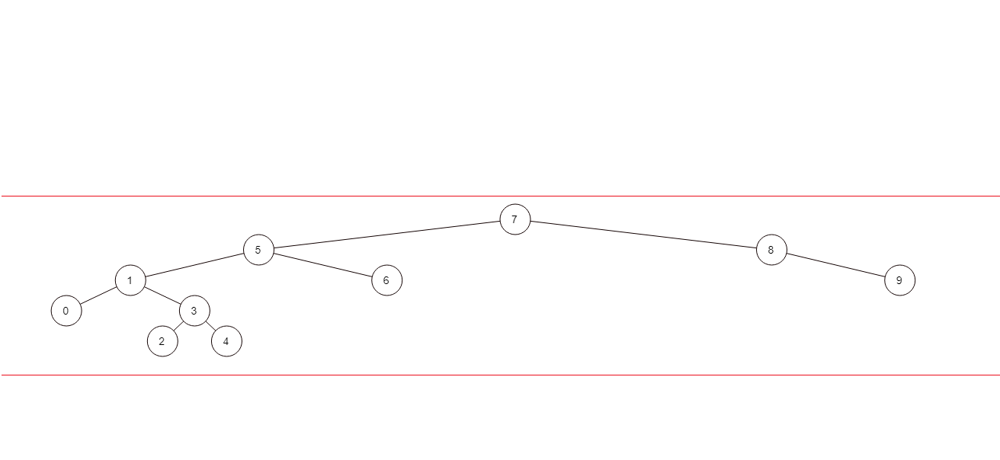

# PROJE-3 (Binary Search Tree Projesi) 
- ## [7, 5, 1, 8, 3, 6, 0, 9, 4, 2] dizisinin Binary-Search-Tree aşamalarını yazınız.

 ==Binary search tree'ye eleman eklemeye root'dan başlanır. eklenecek eleman,root elemandan büyükse root'un sağ tarafına;eklenecek eleman root elemandan küçükse,root'un sol tarafına eklenerek ilerlenir.== 

---

- Bu tree'de root eleman 7'dir.

- 7'den sonra,5 sayısını root'a eklemek için:root'un(7) solunda işlem yaparız çünkü 5 sayısı 7 sayısından küçüktür.

- Daha sonra;1 sayısı,7 ve 5'ten küçük olduğu için;5'in soluna yerleştirilir.

- 8 sayısı,7'den büyüktür.7'nin sağına yerleştirilir.

- 3 sayısı,7 ve 5'ten küçük olduğu için 5'in soluna;1'den büyük olduğu için 1'in sağına yerleştirilir.

- 6 sayısı,7'den küçük olduğu 7'nin soluna;fakat 5'ten büyük olduğu için 5'in sağına yerleştirilir.

- 0 sayısı 7,5 ve 1'den küçük olduğu için,1'in soluna yerleştirilir.

- 9 sayısı,7 ve 8'den büyük olduğu için 8'in sağına yerleştirilir.

- 4 sayısı, 7 ve 5'ten küçük olduğu için 5'in soluna;1 ve 3'ten büyük olduğu için 3'ün sağına yerleştirilir.

- 2 sayısı,7 ve 5'ten küçük olduğu için 5'in soluna;1'den büyük olduğu için 1'in sağına, 3'ten küçük olduğu için 3'ün soluna yerleştirilir.

 www.patika.dev